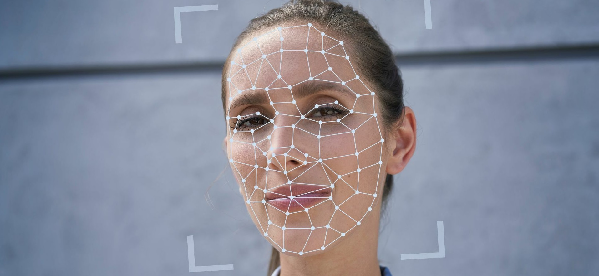
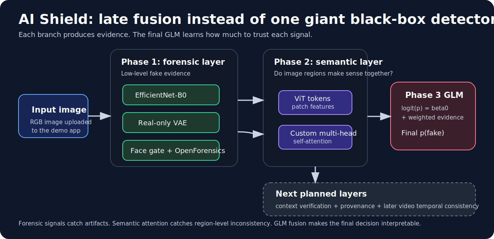
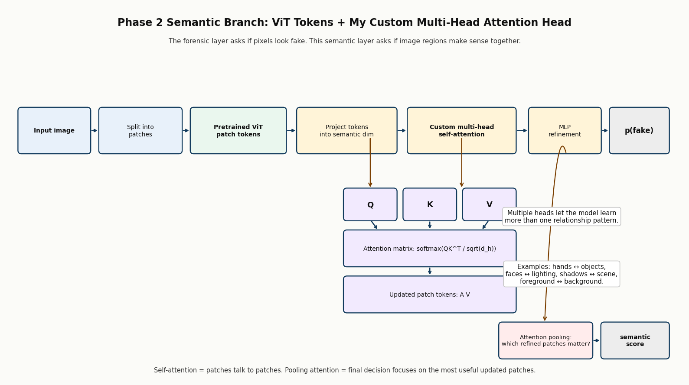
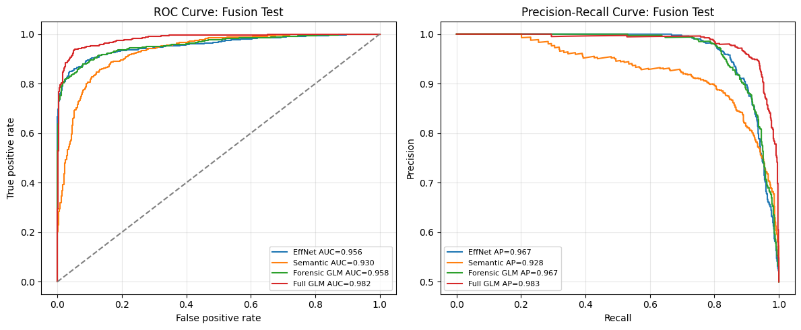
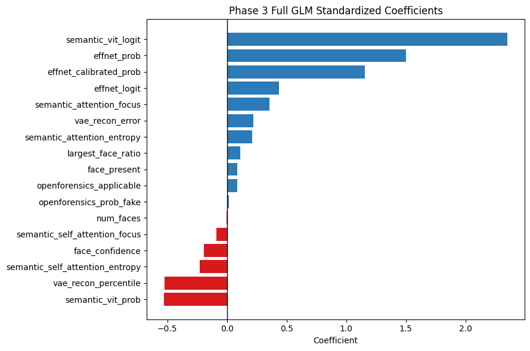
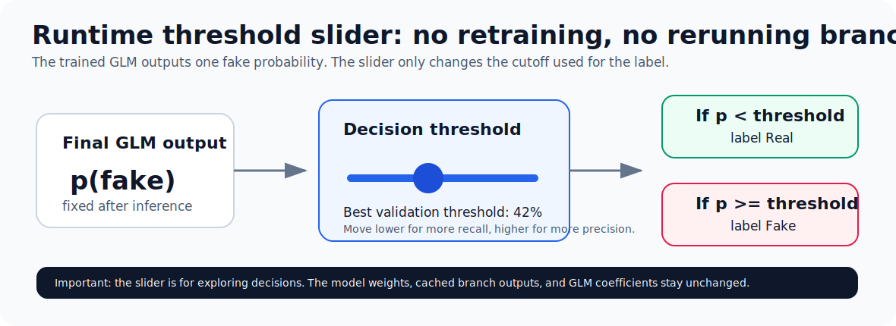

# AI Shield: Forensic + Semantic Deepfake Image Detector

<p align="center">
  
</p>

AI Shield is my final machine learning project for building a practical image-authenticity pipeline. The long-term goal is a system that can inspect AI-generated images and, later, videos. For this assignment I focused on the image version and built two working layers:

- **Phase 1: forensic evidence** from low-level visual artifacts, reconstruction error, and face-specific manipulation cues.
- **Phase 2: semantic evidence** from a ViT-based attention model that looks at how image regions relate to each other.
- **Phase 3: late fusion** with a GLM/logistic-regression meta-layer that combines both layers into one final fake probability.

The important design choice is that the final model is not one giant black-box image model. Each branch produces evidence, then the final GLM learns how much to trust each evidence source.

## Visual Overview

<p align="center">
  
</p>

This is the main idea of the project. The forensic layer catches pixel-level and face-level evidence. The semantic layer checks whether image regions make sense together. The final GLM layer combines those signals into one interpretable fake probability.

## Main Links

| Resource | Link |
|---|---|
| Deployed app | <https://huggingface.co/spaces/AbdelrahmanSoliman/AI_sheild> |
| GitHub repository | <https://github.com/Abdulrahmansoliman/AI-SHEILD-MINI-CAPSTONE> |
| Tiny-GenImage dataset | <https://huggingface.co/datasets/TheKernel01/Tiny-GenImage> |
| OpenForensics paper/dataset page | <https://openaccess.thecvf.com/content/ICCV2021/html/Le_OpenForensics_Large-Scale_Challenging_Dataset_for_Multi-Face_Forgery_Detection_and_Segmentation_ICCV_2021_paper.html> |
| Original GenImage project | <https://github.com/GenImage-Dataset/GenImage> |

## What The App Does

Upload an image and the deployed app runs:

1. **EfficientNet-B0 forensic classifier**
   - Broad real/fake image detector trained on Tiny-GenImage.
   - Produces `effnet_logit`, `effnet_prob`, and calibrated `effnet_calibrated_prob`.

2. **Real-only VAE anomaly branch**
   - Learns reconstruction behavior from real images.
   - Produces reconstruction error and reconstruction-error percentile.
   - This is an anomaly score, not a direct fake probability.

3. **Computer-vision face gate**
   - Checks whether a valid face is present.
   - Prevents the face-specific model from being trusted on images where no face exists.

4. **OpenForensics face branch**
   - Face-specific manipulation detector.
   - Only meaningful when the face gate finds a valid face.

5. **Semantic ViT attention branch**
   - Uses a pretrained ViT backbone plus my custom semantic transformer head.
   - The custom head includes multi-head self-attention, attention pooling, and a classifier.
   - Produces semantic fake probability and attention summary features.

6. **Final Phase 3 GLM fusion**
   - Combines forensic and semantic evidence into one final fake probability.
   - Also exposes the Phase 1 forensic-only GLM score so the user can compare the forensic layer against the full system.

### Semantic Attention Head

<p align="center">
  
</p>

The semantic model does not just ask whether pixels look fake. It uses ViT patch tokens and a custom multi-head attention head so patches can compare themselves with other patches before the classifier makes a decision. This is useful for semantic failures such as strange hands, inconsistent object relationships, or scenes where local textures look clean but the full image does not make sense.

## Final Test Results

These are the saved Phase 3 test metrics from the deployment bundle.

| Model | AUC | Accuracy | Precision | Recall | F1 | Brier | Threshold |
|---|---:|---:|---:|---:|---:|---:|---:|
| EfficientNet calibrated | 0.956 | 0.903 | 0.939 | 0.861 | 0.899 | 0.078 | 0.56 |
| Semantic ViT attention | 0.930 | 0.859 | 0.840 | 0.887 | 0.863 | 0.113 | 0.64 |
| Phase 1 forensic-only GLM | 0.958 | 0.897 | 0.919 | 0.871 | 0.894 | 0.075 | 0.39 |
| Final forensic + semantic GLM | **0.982** | **0.941** | **0.943** | **0.939** | **0.941** | **0.049** | 0.42 |

The final model improves because it combines two different kinds of evidence. The forensic layer is good at low-level artifact detection. The semantic layer helps when the pixels look clean but the image regions or object relationships still look suspicious.

### Fusion Curves

<p align="center">
  
</p>

The red curve is the full forensic + semantic GLM. It gives the strongest ROC-AUC and average precision because it uses both evidence families instead of trusting one branch alone.

### What The GLM Learned

<p align="center">
  
</p>

This coefficient plot is why I like the GLM fusion layer. It is not just a black-box average. Positive coefficients push the final decision toward fake, while negative coefficients pull it back toward real after feature scaling. The model learned that both semantic evidence and forensic evidence matter, but not every branch should receive the same weight.

### Runtime Threshold Slider

<p align="center">
  
</p>

The deployed app includes a threshold slider. Moving it does not retrain or rerun the models. It only changes the cutoff used to convert the final fake probability into a Real/Fake label. The best validation-selected threshold for the final GLM is **42%**.

## Dataset Choices

### Tiny-GenImage

Tiny-GenImage was the main supervised real/fake image dataset for the Phase 1 and Phase 2 branches. I intentionally kept the same dataset and split across the forensic and semantic notebooks because the goal was to test whether the semantic layer adds complementary information, not whether a new dataset changes the distribution.

Using the same dataset also makes the final fusion clean: every row in the fusion table can align the forensic evidence and semantic evidence for the same image.

### OpenForensics

OpenForensics was used for the face-specific branch. This was important because many generated or manipulated images include people, and a general image detector is not always enough for face manipulation. The deployed system uses a face gate so the OpenForensics score is only trusted when a valid face is detected.

## Repository Map

```text
deepfake-image-detector/
|-- README.md
|-- DEPLOYMENT.md
|-- requirements.txt
|-- streamlit_app.py
|-- deployment/
|   |-- ai_shield_app.py
|   `-- ai_shield_inference.py
|-- notebooks/
|   |-- phase1_forensic_report.ipynb
|   |-- phase2_semantic_report.ipynb
|   |-- phase3_fusion_report.ipynb
|   `-- make_ai_shield_deployment_bundle_colab.ipynb
|-- reports/
|   |-- assignment.tex
|   `-- legacy/
|-- scripts/
|   `-- extract_notebook_figures.py
|-- src/
|   |-- ai_shield_cache.py
|   |-- ai_shield_drive.py
|   |-- ai_shield_metrics.py
|   `-- ai_shield_plots.py
|-- code/
|   |-- main/
|   |-- PretrainedModel/
|   `-- results/
`-- assets/
    |-- project/
    |   `-- readme/
    `-- legacy_screenshots/
```

## Running Locally

The easiest way to inspect the project is the hosted Hugging Face app:

<https://huggingface.co/spaces/AbdelrahmanSoliman/AI_sheild>

For local inference, the app needs the deployment artifact bundle. The bundle is large, so it is not meant to be edited inside the repo.

```bash
pip install -r requirements.txt
streamlit run streamlit_app.py
```

The local app expects:

```text
ai_shield_deployment_bundle.zip
```

in the repository root. On first run it extracts the bundle into:

```text
deployment_artifacts/
```

Deployment details are in [DEPLOYMENT.md](DEPLOYMENT.md).

## Notebooks

The report notebooks are the reproducibility appendices for the project:

| Notebook | Purpose |
|---|---|
| `notebooks/phase1_forensic_report.ipynb` | Forensic layer: EfficientNet, VAE, OpenForensics, face-gated fusion |
| `notebooks/phase2_semantic_report.ipynb` | Semantic layer: ViT tokens, custom multi-head self-attention, semantic cache |
| `notebooks/phase3_fusion_report.ipynb` | Final fusion: merge forensic + semantic outputs, train GLM, evaluate |
| `notebooks/make_ai_shield_deployment_bundle_colab.ipynb` | Collects trained artifacts from Drive into a deployment bundle |

The notebooks are written to be Colab-friendly and artifact-safe. They check Drive for existing checkpoints, cached predictions, CSVs, plots, and metrics before running expensive stages.

## Hand-Built Parts

The project uses pretrained models where that is the correct engineering choice, but several important parts are implemented directly:

- custom branch-output caching and feature-table construction
- face-gated OpenForensics routing logic
- custom semantic transformer head on top of ViT patch tokens
- custom multi-head self-attention block in PyTorch
- late-fusion GLM feature construction and evaluation
- deployment inference wrapper that reproduces the trained pipeline

## Artifact Policy

Large model files and generated bundles should not be casually committed to GitHub. The repository keeps the code, notebooks, report source, and helper scripts. The working demo is hosted on Hugging Face, and the notebooks describe where the Google Drive artifacts are stored during training.

This matters because the trained checkpoints are large and the notebooks already preserve the training outputs. The repo should stay readable enough for someone to understand the project without downloading hundreds of megabytes first.

## Project Story

This started as a deepfake detector, but the failures of a single classifier made the project more interesting. A real authenticity system needs several kinds of evidence:

- forensic signals for pixel-level artifacts
- semantic signals for whether image regions make sense together
- context signals for whether the content is plausible in the real world
- provenance signals for metadata and source history

This repo implements the first two image layers and a final GLM fusion layer that combines them. Context and provenance are the next planned phases.
